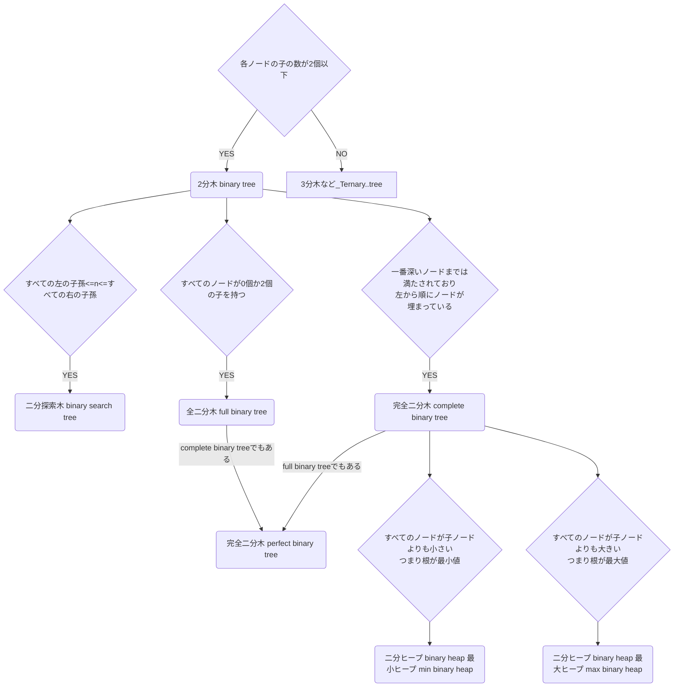

# 木を見分ける

```mermaid
graph TD;
    nodeunder2{各ノードの子の数が2個以下} -->|YES| binaryTree(2分木 binary tree);
    nodeunder2 -->|NO| 3分木など_Ternary..tree;
    binaryTree --> isSearchTree{すべての左の子孫<=n<=すべての右の子孫};
    isSearchTree -->|YES| binarySearchTree(二分探索木 binary search tree) ;
    binaryTree --> isCompleteBinaryTree{一番深いノードまでは<br>満たされており<br>左から順にノードが<br>埋まっている} -->|YES|completeBinaryTree(完全二分木 complete binary tree)
    binaryTree --> isFullBinaryTree{すべてのノードが0個か2個の子を持つ} -->|YES|fullBinaryTree(全二分木 full binary tree)
    completeBinaryTree -->|full binary treeでもある| perfectBinaryTree(完全二分木 perfect binary tree)
    fullBinaryTree -->|complete binary treeでもある| perfectBinaryTree(完全二分木 perfect binary tree)
    completeBinaryTree --> isMinHeap{すべてのノードが子ノードよりも小さい<br>つまり根が最小値}
    isMinHeap --> minHeap(二分ヒープ binary heap 最小ヒープ min binary heap)
    completeBinaryTree --> isMaxHeap{すべてのノードが子ノードよりも大きい<br>つまり根が最大値}
    isMaxHeap --> maxHeap(二分ヒープ binary heap 最大ヒープ max binary heap)

```
